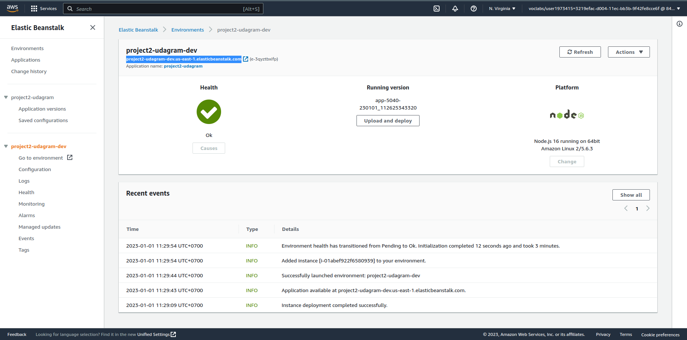

# Project 2: Udagram Image Filtering Server on Elastic Beanstalk

> **Elastic Beanstalk URL**: [project2-udagram-dev.us-east-1.elasticbeanstalk.com](http://project2-udagram-dev.us-east-1.elasticbeanstalk.com/)

The following image shows successful deployment of project 2 on AWS cloud.

  

